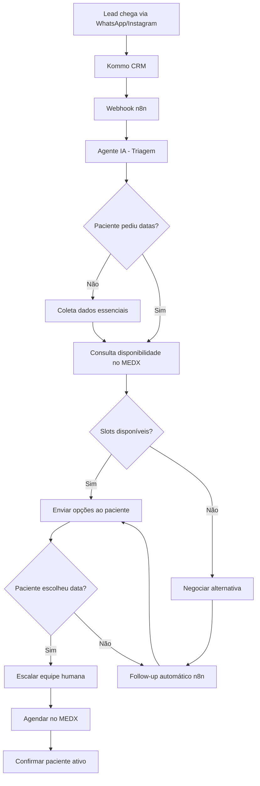

# Arquitetura do Sistema Dr. Igor

## Visão Geral da Arquitetura

## Componentes do Sistema

### 1. Kommo CRM (Frontend)
- **Função**: Central de relacionamento omnicanal e painel da equipe humana.
- **Recursos principais**:
  - Conversas WhatsApp/Instagram integradas.
  - Pipeline dedicado às etapas de triagem e agendamento.
  - Campos customizados para registrar preferências de data/horário e histórico de follow-up.
  - Notificações para handoff manual.

### 2. n8n (Motor de Automação)
- **Função**: Orquestrar automações entre Kommo, MEDX e os agentes de IA.
- **Workflows ativos**:
  - Triagem e checagem de disponibilidade (`fluxo_qualificacao`).
  - Follow-up automatizado para leads parados (`fluxo_followup`).
  - Robôs de notificação e tarefas internas (no kommo)

### 3. Agente IA (OpenAI GPT-4)
- **Função**: Conduzir a conversa, coletar dados e orientar o paciente.
- **Capacidades**:
  - Seguir roteiros de triagem e follow-up definidos em prompt.
  - Aplicar as respostas rápidas (RAQ) e protocolos de objeção.
  - Validar informações recebidas antes de confirmar disponibilidade.
  - Solicitar ajuda humana diante de exceções ou falhas de integração.

### 4. MEDX Agenda
- **Função**: Fonte única de disponibilidade para consultas do Dr. Igor.
- **Recursos esperados**:
  - Consulta de slots livres por data/horário.
  - Bloqueio temporário de vaga enquanto a equipe confirma.
  - API autenticada com logs para auditoria.

### 5. Equipe Humana
- **Função**: Finalizar agendamentos, negociar objeções complexas e dar suporte clínico.
- **Ferramentas**: Kommo (tarefas/notas), MEDX (confirmação final) e canais internos.

## Fluxo Detalhado

### Etapa 1: Recepção do Lead
1. Paciente envia mensagem via WhatsApp/Instagram.
2. Kommo cria/atualiza o lead e dispara webhook para o n8n.
3. Dados estruturados (texto, metadados, status) são entregues ao agente IA.

### Etapa 2: Triagem Assistida por IA
1. Agente confere se já possui nome, objetivo clínico e dados básicos.
2. Coleta idade, histórico relevante e valida o interesse.
3. Apresenta valor, formas de pagamento e diferenciais do Dr. Igor conforme RAQ.
4. Identifica quando o paciente pede ou menciona datas/horários.

### Etapa 3: Consulta de Disponibilidade
1. Ao detectar interesse em agendar, o agente chama o conector MEDX.
2. Slots disponíveis são cruzados com a preferência do paciente.
3. Se houver vaga compatível, o agente apresenta opções claras (data + hora).
4. Caso não exista disponibilidade, negocia alternativas (próximos dias ou lista de espera).

### Etapa 4: Encaminhamento Humano
1. Assim que o paciente escolhe um horário (ou pede trato especial), o bot confirma pré-reserva.
2. Lead é movido para o status de atendimento humano com nota contendo os detalhes do agendamento.
3. A equipe humana liga ou confirma via MEDX, garantindo a efetivação.
4. Resultado final: status "Agendado" no Kommo e bloqueio definitivo no MEDX.

### Etapa 5: Follow-up Automático
1. Se o paciente não responde após receber opções, o fluxo automático inicia tentativas graduais (24h, 48h, 7 dias).
2. Mensagens reforçam benefícios e convidam a retomar a conversa.
3. Após três tentativas sem retorno, lead entra em repouso (status "Follow-up" ou "Não interessado").
4. Qualquer resposta do paciente reinicia o fluxo de triagem a partir da última etapa concluída.

## Métricas e Monitoramento

### KPIs Principais
- **Taxa de conversão em agendamentos confirmados**.
- **Tempo médio entre primeiro contato e envio de disponibilidades**.
- **Tempo médio para confirmação humana após escolha do paciente**.
- **Eficácia do follow-up** (respostas por tentativa e reconversão).

### Dashboard em Tempo Real
- Leads por status da pipeline.
- Volume de consultas à API do MEDX e taxa de sucesso.
- Alertas de falha (integração indisponível, prompts bloqueados, etc.).

### Relatórios Analíticos
- Objeções mais comuns e como foram tratadas.
- Preferências de datas/horários com maior demanda.
- Comparativo entre atendimentos presenciais e on-line.

## Integrações Necessárias

### 1. Kommo ↔ n8n
- Webhooks de entrada de mensagem e de mudança de status.
- Atualização de status, notas e campos customizados.
- Autenticação via OAuth 2.0 ou token seguro.

### 2. n8n ↔ MEDX
- Consulta de disponibilidade com filtros por profissional, data e turno.
- Endpoint para bloqueio temporário (hold) e liberação automática.
- Logs de requisições para auditoria e compliance.

### 3. n8n ↔ OpenAI
- Modelos GPT-4 para triagem e follow-up.
- Controle de limites de uso e fallback para respostas pré-definidas.

## Segurança e Compliance

### LGPD
- Obter consentimento explícito para realizar follow-up.
- Permitir opt-out imediato via palavra-chave.
- Criptografar dados sensíveis em trânsito e repouso.

### CFM (Conselho Federal de Medicina)
- Nenhum diagnóstico ou prescrição via chat.
- Sempre direcionar dúvidas clínicas para consulta formal.
- Registrar interações e decisões críticas (handoff, objeções).

### Segurança Técnica
- HTTPS/TLS em todas as integrações.
- Rotação de tokens de API (Kommo, MEDX, OpenAI).
- Retenção de logs e backups periódicos.

## Recursos Necessários

### Equipe
- Desenvolvedor n8n (workflows e integrações).
- Especialista Kommo (pipeline e automações).
- Analista de IA (prompts, tuning e QA).
- Equipe de atendimento humano (confirmação de agenda).

### Infraestrutura
- n8n (cloud ou self-hosted) com monitoração.
- Acesso estável ao MEDX e OpenAI.
- Plano Kommo compatível com webhooks e custom fields.

### Custos Estimados (Mensais)
- Kommo: R$ 300-500
- n8n: R$ 200-400
- OpenAI: R$ 150-300
- Licença/integração MEDX: conforme contrato
- Desenvolvimento/Manutenção: R$ 3.000-5.000
- **Total estimado**: R$ 3.650-6.500/mês
